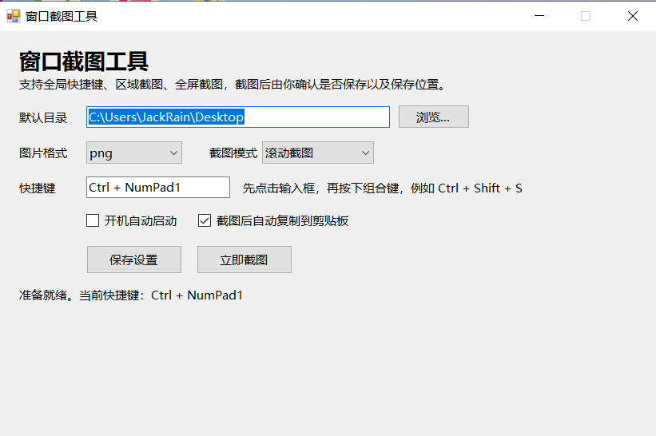

# Windows 截图工具

一个面向 Windows 本地使用的截图工具项目，当前以“**源码 + 可直接运行 EXE 一起分发**”的方式维护。

## 项目文件

- 主程序：`ScreenCaptureTool_CN.exe`
- 静默启动脚本：`run_screen_capture_tool.vbs`
- 源码：`ScreenCaptureTool_CN.cs`
- 配置文件：`screen_capture_settings_native_cn.ini`
- 图标：`ScreenCaptureTool_CN.ico`
- 预览图：`ScreenCaptureTool_CN.png`
- 使用界面截图：`使用界面.png`

## 界面预览

## 功能特性

- 支持全局快捷键自定义
- 支持区域截图和全屏截图
- 支持滚动截图（自动翻页拼接）
- 支持导出 `png`、`jpg`、`bmp`、`gif`、`tiff`
- 支持开机启动
- 支持托盘常驻
- 支持截图后自动复制到剪贴板
- 支持截图后弹出预览窗口
- 预览窗口支持放大、缩小、100% 还原、`Ctrl + 滚轮` 缩放
- 支持在预览窗口中连续框选区域进行 OCR 识别
- OCR 识别结果会自动追加到输出框，并可复制到剪贴板
- OCR 识别前会自动进行外扩选区、放大与轻量增强，以提升小字和轻微偏移场景下的识别率

## 快速开始

### 直接运行

优先运行：`ScreenCaptureTool_CN.exe`

### 静默启动

如需以脚本方式启动，可运行：`run_screen_capture_tool.vbs`

### 建议使用顺序

1. 先运行主程序，确认托盘与截图功能正常
2. 按需调整 `screen_capture_settings_native_cn.ini` 中的相关设置
3. 如需静默启动或加入启动项，再使用 `run_screen_capture_tool.vbs`

## 使用方式

- 区域截图：使用已配置的截图快捷键进行区域选择
- 全屏截图：使用已配置的全屏截图快捷键
- 滚动截图：在目标窗口可响应 `PageDown` 的前提下使用
- OCR 识别：在预览窗口内点击 `OCR框选` 后，可连续框选多个目标区域执行识别
- OCR 退出：按 `Esc` 或再次点击 `OCR框选` 按钮即可退出连续框选模式

## 配置说明

- 程序运行配置文件为：`screen_capture_settings_native_cn.ini`
- 如需调整快捷键或相关行为，请优先备份原配置后再修改

## 版本说明

- 版本 `1.0` 视为此前确认可用的基础版
- 当前目录仅保留最新版本文件
- 后续如需回退或继续迭代，以 `1.0` 需求集合作为基线继续调整

## 补充说明

- 滚动截图依赖目标窗口能响应 `PageDown` 翻页，适合网页、文档、聊天记录等纵向内容
- 当前仓库保留可直接运行的 EXE，便于本地使用和版本备份
- 如后续确认 EXE 可稳定由源码重建，再考虑调整分发与版本管理策略

## 适用场景

- 日常桌面截图
- 文档与网页内容保存
- 聊天记录长图截取
- 局部 OCR 文字提取

## 常见问题（FAQ）

### 1. 为什么仓库里同时保留源码和 EXE？

当前项目以“源码 + 可直接运行 EXE 一起分发”的方式维护，便于本地直接使用与远程备份。若后续确认 EXE 可稳定由源码重建，再考虑是否调整版本管理策略。

### 2. 滚动截图为什么有时无效？

滚动截图依赖目标窗口能响应 `PageDown` 翻页。如果目标程序不支持键盘翻页、页面存在特殊懒加载逻辑，或滚动区域不是当前焦点窗口，可能导致滚动截图效果不稳定。

### 3. OCR 识别怎么使用？

先完成截图并打开预览窗口，点击 `OCR框选` 进入连续识别模式，再在预览窗口中框选目标区域进行 OCR 识别。每次识别结果都会自动追加到下方输出框，完成后可直接复制到剪贴板。按 `Esc` 或再次点击 `OCR框选` 可退出该模式。

### 4. 为什么有时 OCR 仍会出现错别字或漏字？

当前项目已对 OCR 增加基础识别增强，包括自动外扩选区、放大和轻量图像增强。但底层仍使用 Windows 系统 OCR，因此在字体过小、背景复杂、边缘模糊或框选范围包含过多干扰内容时，仍可能出现错别字或漏字。建议尽量框住主要文字区域，避开图标、边框和复杂背景。

### 5. 配置文件可以直接改吗？

可以，但建议先备份 `screen_capture_settings_native_cn.ini`，再修改快捷键或相关行为设置。

## GitHub Releases 自动发布

仓库已补充 GitHub Actions 自动发布流程。

### 触发方式

当你向远端推送符合 `v*` 规则的 tag 时，会自动创建 GitHub Release。

示例：

- `v1.0-trial` → 自动识别为 **试用版 V1.0**，并标记为预发布
- `v1.1` → 自动识别为正式版 `V1.1`

### 自动上传的 Release 资产

- `screen_capture_tool_<tag>.zip`
- `ScreenCaptureTool_CN.exe`
- `run_screen_capture_tool.vbs`

### 发布正文来源

- 自动 Release 正文优先从 `CHANGELOG.md` 中按 tag 对应区块自动抽取  <!-- 改为单一事实来源，减少重复维护 -->
- 工作流文件：`.github/workflows/release.yml`
- `RELEASE_BODY.md` 可继续保留为手工发布参考草稿

### 使用建议

如需发布 `试用版 V1.0`，只需推送对应 tag 即可。后续如要调整自动发布正文，直接编辑 `CHANGELOG.md` 中对应版本区块即可。  <!-- 说明自动发布入口，便于后续维护 -->

## 更新日志

详见：[`CHANGELOG.md`](./CHANGELOG.md)

## 说明

本仓库当前主要用于本地维护与远程备份。若后续持续迭代，可继续补充：

- 编译方式与依赖说明
- 更多使用示例
- 故障排查说明
